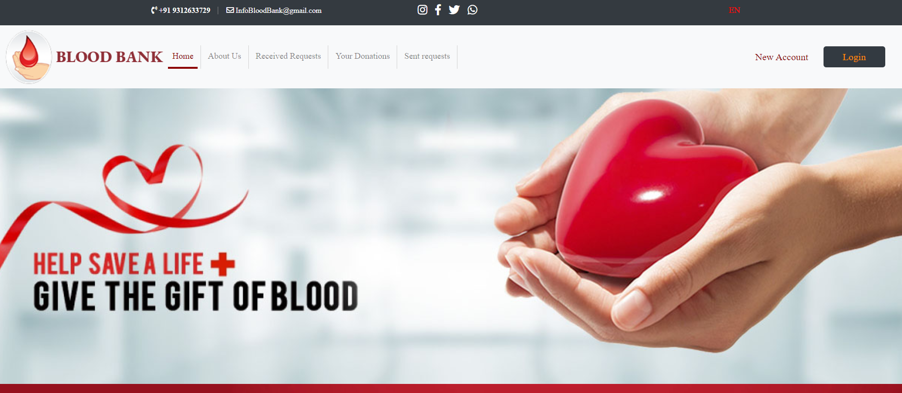
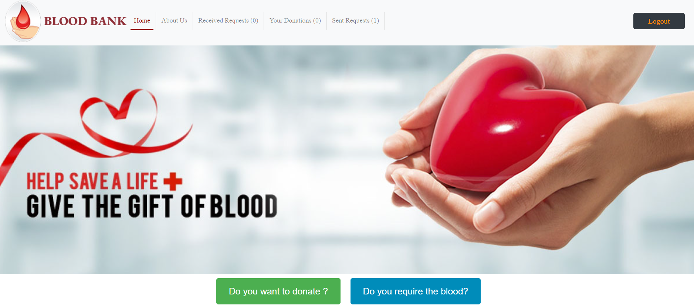
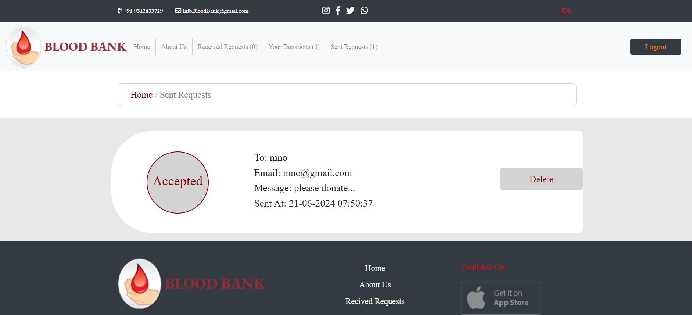
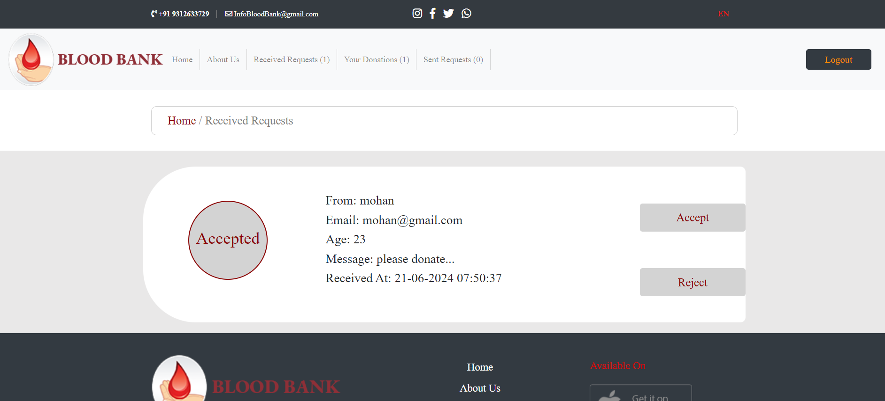

<p align="center"><a href="https://laravel.com" target="_blank"></a></p>

<p align="center">
<a href="https://github.com/laravel/framework/actions"></a>
<a href="https://packagist.org/packages/laravel/framework"></a>
<a href="https://packagist.org/packages/laravel/framework"></a>
<a href="https://packagist.org/packages/laravel/framework"></a>
</p>

# BloodBank

## Installation
```bash
composer global require laravel/installer

laravel new bloodbank-app
```
```bash
cd bloodbank-app
 
php artisan serve
```

## Features
* Donor Registration: Donors can register themselves on the platform and 
provide their blood donation details.
* Blood Donation: Registered donors can update their availability for blood 
donation.
* Blood Request: Users who require blood can send a request to the donors.
* Request Management: Donors can accept or reject the blood donation 
requests they receive.

## Images





## License

The Laravel framework is open-sourced software licensed under the [MIT license](https://opensource.org/licenses/MIT).
